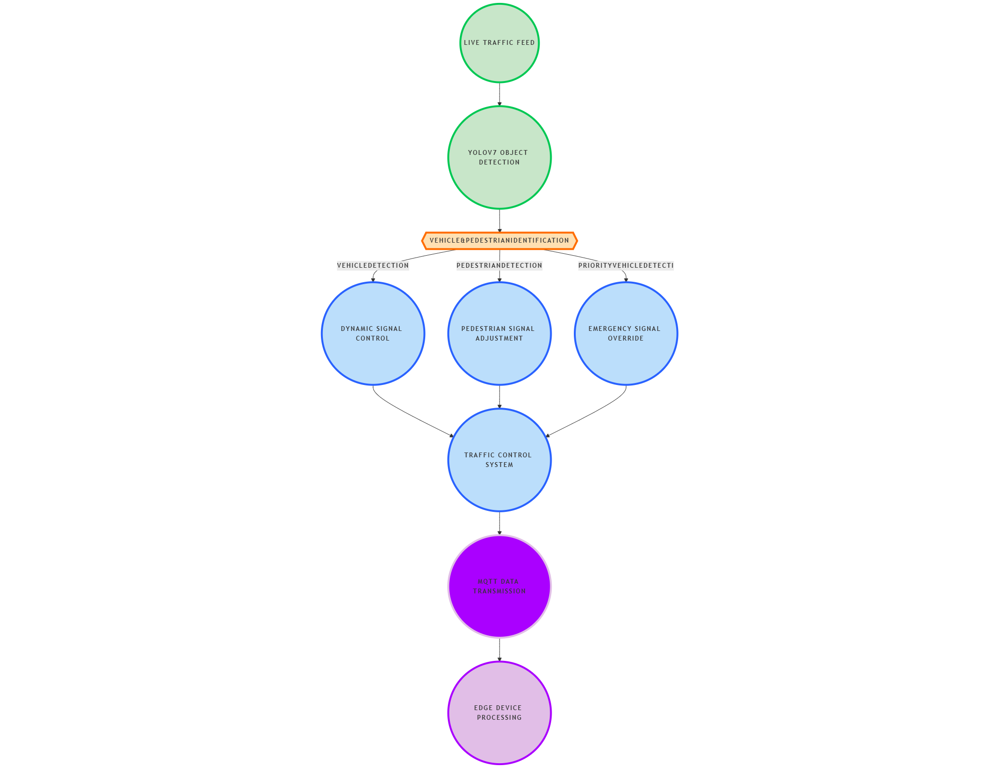

# Intelligent Traffic Management System using CNN - YOLOv7 with Integrated MQTT Protocol

## Guided By

- Dr. Tapan Jain

## Introduction

This project implements an **Intelligent Traffic Management System (ITMS)** utilizing **YOLOv7** for real-time object detection and **MQTT Protocol** for data communication. The system optimizes traffic flow by dynamically adjusting signals based on detected vehicles, pedestrians, and priority vehicles.

## How the System Works

1. Captures live traffic feed using a camera.
2. Utilizes YOLOv7 for real-time object detection.
3. Identifies vehicles, pedestrians, and emergency vehicles.
4. Dynamically adjusts traffic signals based on detected entities.
5. Transmits traffic data to edge devices via MQTT protocol for further processing.

## Explanation of Core Technologies

### 1. YOLOv7 (You Only Look Once v7)

- **YOLOv7** is a state-of-the-art deep learning model for object detection.
- Processes images in real-time with high accuracy.
- Utilized to detect **vehicles, pedestrians, and emergency vehicles**.

### 2. CNN (Convolutional Neural Networks)

- Extracts features from traffic images.
- Helps YOLOv7 in precise object recognition.

### 3. MQTT (Message Queuing Telemetry Transport)

- A lightweight messaging protocol optimized for IoT applications.
- Enables **real-time transmission of detected traffic data** to edge devices.

### 4. Edge Computing

- Processes the detected traffic data locally.
- Reduces latency by making real-time decisions.

## Workflow Diagram

## Comparison Table

| Feature            | Traditional Systems | Proposed ITMS    |
| ------------------ | ------------------- | ---------------- |
| Detection Accuracy | Low                 | High (YOLOv7)    |
| Response Time      | Slow                | Real-time (MQTT) |
| Adaptability       | Static              | Dynamic          |
| IoT Integration    | No                  | Yes              |

## Challenges Faced

- Optimizing YOLOv7 for low-latency detection.
- Efficient real-time data transfer using MQTT.
- Managing varying traffic conditions dynamically.

## Future Enhancements

- Implement **5G-enabled IoT sensors** for improved communication.
- Enhance pedestrian safety measures with **smart crosswalks**.
- Use **reinforcement learning** to improve traffic control efficiency.

## Presented By

- **Mann Manohar (BT22ECI017)**
- **Sai Chandra Mouli (BT22ECI035)**
- **Mithilesh Walde (BT22ECI056)**

## License

This project is open-source and can be used for academic and research purposes.
